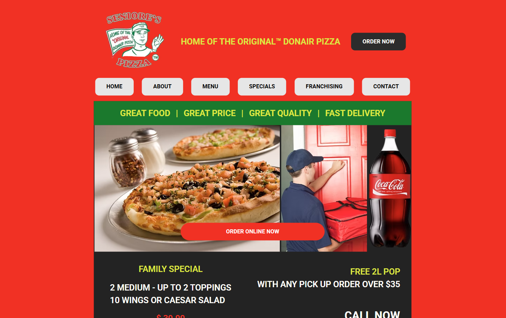

# Seniore's Pizza Replica Website

This project is a **replica of the Seniore's Pizza website**, created as part of a **school project** to demonstrate the use of more advanced **HTML elements** and **interactive components**.

> **Note:** This project is for **educational purposes only** and is **not affiliated** with the actual Seniore's Pizza business.

---

## 🚀 Live Demo
[View the Live Website](https://jayco01.github.io/pizza-replica-webpage/)

---

## 📸 Screenshot

---

## 🛠️ Technologies Used
- **HTML5**
- **CSS3**

---

## 🌟 Key Features
- **Navigation Bar:** Easily navigate between pages.
- **Contact Form:** Simple form for users to reach out (non-functional for this project).
- **Social Icons:** Placeholder icons for social media links.
- **Responsive Design:** Optimized for desktop and mobile devices.